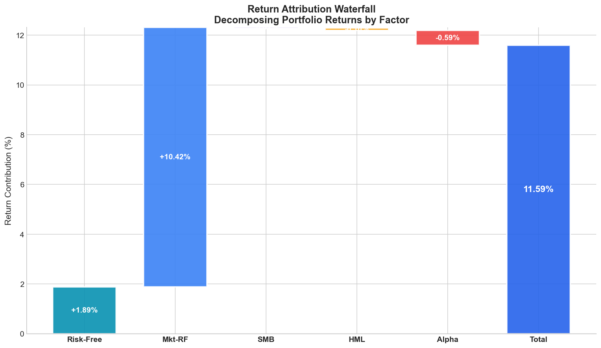
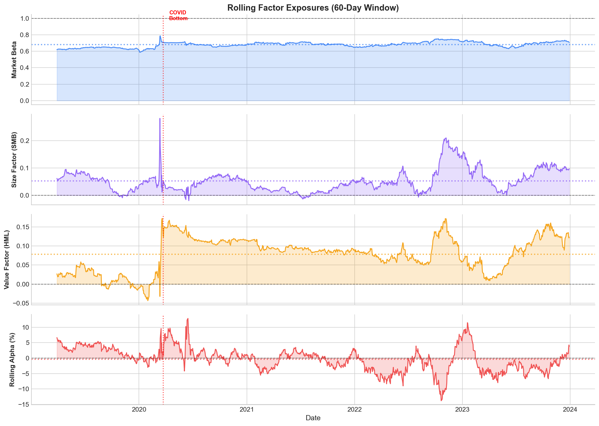

# Portfolio-Analysis

[](https://engineer-investor-portfolio-analysis.streamlit.app/)
[](https://badge.fury.io/py/engineer-investor-portfolio)
[](https://engineerinvestor.github.io/Portfolio-Analysis/)
[](https://github.com/engineerinvestor/Portfolio-Analysis/actions/workflows/tests.yml)
[](https://opensource.org/licenses/MIT)

Open-source portfolio analysis tools for DIY investors and finance enthusiasts. This repository aims to provide a comprehensive suite of tools to analyze and optimize investment portfolios, with an emphasis on transparency, flexibility, and extensibility.

## Documentation

**[Read the Full Documentation](https://engineerinvestor.github.io/Portfolio-Analysis/)** - Comprehensive guides, API reference, and examples.

## Quick Start

### Try Online (No Installation)

**Google Colab Notebooks:**
- [Basic Portfolio Analysis](https://colab.research.google.com/github/engineerinvestor/Portfolio-Analysis/blob/main/Basic_Portfolio_Analysis.ipynb) - Core analysis tutorial
- [Interactive Portfolio Analysis](https://colab.research.google.com/github/engineerinvestor/Portfolio-Analysis/blob/main/Interactive_Portfolio_Analysis.ipynb) - Widget-based interface
- [Factor Analysis Demo](https://colab.research.google.com/github/engineerinvestor/Portfolio-Analysis/blob/main/Factor_Analysis_Demo.ipynb) - Fama-French factor models

### Install as Python Package

```bash
pip install engineer-investor-portfolio
```

Or install from source with all features:

```bash
git clone https://github.com/engineerinvestor/Portfolio-Analysis.git
cd Portfolio-Analysis
pip install -e ".[all]"
```

### Run the Streamlit Web App

```bash
pip install -r requirements-streamlit.txt
streamlit run streamlit_app/app.py
```

### Or Use the Live App
[**Launch Streamlit App**](https://engineer-investor-portfolio-analysis.streamlit.app/)


## Features

### Core Analysis
- **Performance Metrics**: Annual return, volatility, Sharpe ratio, Sortino ratio, max drawdown, VaR
- **Portfolio Analysis**: Weighted returns, covariance-based volatility, cumulative returns
- **Monte Carlo Simulation**: Project future portfolio values with confidence intervals
- **Benchmark Comparison**: Alpha, beta, tracking error, information ratio, capture ratios

### Optimization
- Maximum Sharpe Ratio portfolio
- Minimum Volatility portfolio
- Risk Parity (equal risk contribution)
- Target Return optimization
- Efficient Frontier visualization

### Factor Analysis
- **Fama-French Models**: CAPM, FF3, FF5, and Carhart 4-factor regressions
- **Factor Data**: Auto-fetch from Kenneth French Data Library with local caching
- **Return Attribution**: Decompose returns into factor contributions + alpha
- **Risk Attribution**: Variance decomposition by systematic factor
- **Rolling Analysis**: Time-varying factor exposures
- **Characteristic Tilts**: Size, value, momentum, quality, investment tilts
- **Factor Optimization**: Target specific factor exposures or neutralize factors



### HTML Tear Sheet Reports
- Professional portfolio reports inspired by [QuantStats](https://github.com/ranaroussi/quantstats)
- Embedded charts (cumulative returns, drawdowns, monthly heatmap)
- Comprehensive metrics tables (risk, return, ratios)
- Optional benchmark comparison section
- Self-contained HTML files with no external dependencies

### Interactive Tools
- Jupyter widgets for Colab/notebook analysis
- Streamlit web application
- Preset portfolios (60/40, Three-Fund, All-Weather, etc.)

## Usage Examples

### Python Package

```python
from portfolio_analysis import DataLoader, PortfolioAnalysis, MonteCarloSimulation

# Load data
loader = DataLoader(['VTI', 'VXUS', 'BND'], '2018-01-01', '2024-01-01')
data = loader.fetch_data()

# Analyze portfolio
portfolio = PortfolioAnalysis(data, weights=[0.4, 0.2, 0.4])
portfolio.print_summary()

# Run Monte Carlo simulation
mc = MonteCarloSimulation(data, weights=[0.4, 0.2, 0.4], num_simulations=1000)
mc.print_summary()
mc.plot_simulation()
```

### Optimization

```python
from portfolio_analysis import PortfolioOptimizer

optimizer = PortfolioOptimizer(data, risk_free_rate=0.04)
optimal = optimizer.optimize_max_sharpe()
print(f"Optimal weights: {optimal['weights']}")

# Visualize efficient frontier
optimizer.plot_efficient_frontier()
```

### HTML Tear Sheet

```python
from portfolio_analysis import DataLoader, PortfolioAnalysis, BenchmarkComparison
from portfolio_analysis.reporting import ReportBuilder

# Load data and create portfolio
loader = DataLoader(['VTI', 'BND'], '2020-01-01', '2024-01-01')
data = loader.fetch_data()
portfolio = PortfolioAnalysis(data, [0.6, 0.4])

# Generate basic report
report = ReportBuilder(portfolio, title="60/40 Portfolio")
report.generate("tearsheet.html")

# With benchmark comparison
benchmark = BenchmarkComparison(data, [0.6, 0.4], benchmark_ticker='SPY')
report = ReportBuilder(portfolio, benchmark=benchmark, title="60/40 Portfolio")
report.generate("tearsheet_with_benchmark.html")
```

### Factor Analysis

```python
from portfolio_analysis import DataLoader, PortfolioAnalysis
from portfolio_analysis.factors import FactorDataLoader, FactorRegression, FactorAttribution

# Load portfolio data
loader = DataLoader(['VTI', 'VBR', 'VTV', 'BND'], '2019-01-01', '2024-01-01')
data = loader.fetch_data()
portfolio = PortfolioAnalysis(data, [0.4, 0.2, 0.2, 0.2])
returns = portfolio.calculate_portfolio_returns()

# Load Fama-French factors
factor_loader = FactorDataLoader()
ff3 = factor_loader.get_ff3_factors('2019-01-01', '2024-01-01')

# Run factor regression
regression = FactorRegression(returns, ff3)
results = regression.run_regression('ff3')
print(results.summary())
# Output: Alpha, Market Beta, SMB, HML with t-stats and p-values

# Decompose returns by factor
attribution = FactorAttribution(returns, ff3)
decomp = attribution.decompose_returns()
print(f"Market contribution: {decomp['Mkt-RF']:.2%}")
print(f"Alpha: {decomp['alpha']:.2%}")

# Compare all factor models
comparison = regression.compare_models()
print(comparison)  # CAPM vs FF3 vs FF5 vs Carhart
```



## Repository Structure

```
Portfolio-Analysis/
├── portfolio_analysis/          # Python package
│   ├── data/                    # Data loading
│   ├── metrics/                 # Performance & benchmark metrics
│   ├── analysis/                # Portfolio & Monte Carlo analysis
│   ├── factors/                 # Factor analysis (Fama-French, etc.)
│   ├── visualization/           # Plotting & interactive widgets
│   ├── reporting/               # HTML tear sheet generation
│   └── utils/                   # Helper functions
├── streamlit_app/               # Web application
│   └── app.py                   # Main Streamlit app
├── tests/                       # pytest test suite
├── docs/images/                 # Documentation images
├── Tutorials/                   # Additional notebooks
├── Visualization/               # Visualization notebooks
├── Basic_Portfolio_Analysis.ipynb
├── Interactive_Portfolio_Analysis.ipynb
├── Factor_Analysis_Demo.ipynb   # Factor analysis tutorial
├── pyproject.toml               # Package configuration
└── requirements*.txt            # Dependencies
```

## Installation Options

### Minimal (Core Analysis)
```bash
pip install engineer-investor-portfolio
```

### With Optimization
```bash
pip install "engineer-investor-portfolio[optimization]"
```

### With Interactive Widgets
```bash
pip install "engineer-investor-portfolio[interactive]"
```

### With Factor Analysis
```bash
pip install "engineer-investor-portfolio[factors]"
```

### For Streamlit App
```bash
pip install "engineer-investor-portfolio[streamlit]"
```

### Full Development
```bash
pip install "engineer-investor-portfolio[all]"
```

## Contributing

We welcome contributions from the community. Please read the following guidelines:

1. Fork the repository
2. Create a new branch (`git checkout -b feature-name`)
3. Commit your changes (`git commit -m 'Add feature'`)
4. Push to the branch (`git push origin feature-name`)
5. Create a Pull Request

See also: [Beginner's Guide to Contributing](https://github.com/engineerinvestor/Portfolio-Analysis/blob/main/Tutorials/Beginner's_Guide_to_Contributing_to_the_Portfolio_Analysis_Repository.ipynb)

## Roadmap

- [x] Core portfolio analysis classes
- [x] Monte Carlo simulation (fixed)
- [x] Benchmark comparison
- [x] Interactive widgets for Colab
- [x] Python package (PyPI-ready)
- [x] Portfolio optimization
- [x] Streamlit web application
- [x] HTML tear sheet reports
- [x] Factor analysis (Fama-French, Carhart, return/risk attribution)
- [ ] Time-varying risk-free rate (T-bill data)
- [ ] Tax-loss harvesting tools
- [ ] Comprehensive test coverage

## Related Resources

- [Awesome Quant](https://github.com/HugoDelatte/awesome-quant) - Curated quant finance resources
- [QuantStats](https://github.com/ranaroussi/quantstats) - Portfolio analytics
- [PyPortfolioOpt](https://github.com/robertmartin8/PyPortfolioOpt) - Portfolio optimization
- [Riskfolio-Lib](https://riskfolio-lib.readthedocs.io/) - Portfolio optimization and risk management

## Citation

If you use this package in academic work, please cite:

```bibtex
@software{engineer_investor_portfolio_analysis,
  author       = {Engineer Investor},
  title        = {Portfolio-Analysis: Open-source portfolio analysis tools for DIY investors},
  year         = {2026},
  publisher    = {GitHub},
  url          = {https://github.com/engineerinvestor/Portfolio-Analysis}
}
```

## License

This project is licensed under the MIT License - see the [LICENSE](LICENSE) file for details.

## Disclaimer

**This is not investment advice.** These tools are for educational purposes only. Past performance does not guarantee future results. Always do your own research and consider consulting a qualified financial advisor.

## Contact

- Twitter: [@egr_investor](https://twitter.com/egr_investor)
- GitHub: [engineerinvestor](https://github.com/engineerinvestor)
- Email: egr.investor (gmail)
